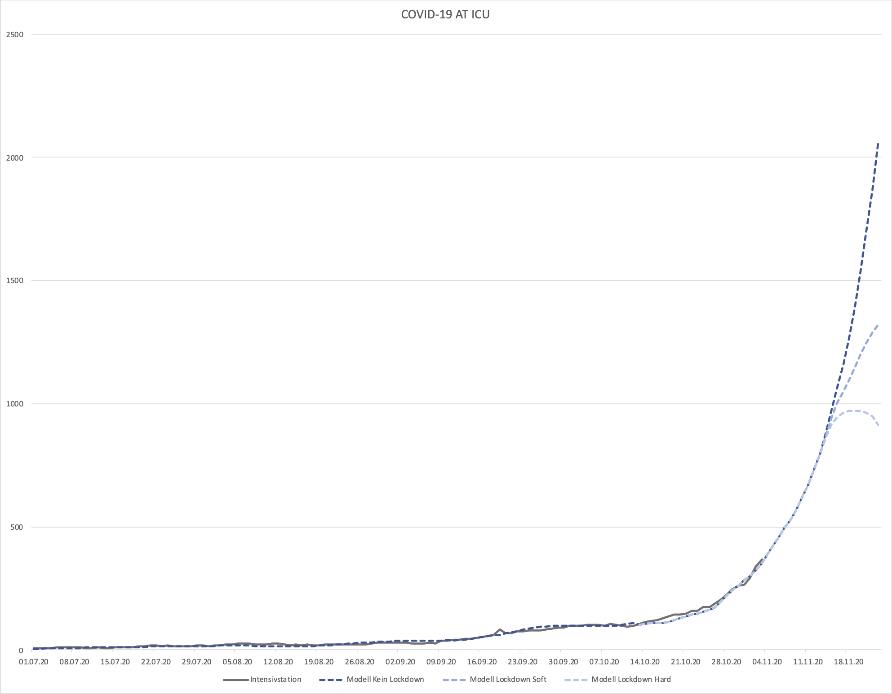

# covid-19-at-hosp

Ein äußerst naiver Versuch, ICU-Hospitalisierungen zu schätzen.

## Annahmen

- [1% ICU-Hospitalisierungsrate](https://orf.at/stories/3187671/) der Infizierten.
- Durchschnittlich 14 Tage ICU Aufenthalt (ausgehend von ["Dauer der künstlichen Beatmung"](https://www.i-med.ac.at/mypoint/news/744490.html)).
- 7 Tage Verzug bis zur Wirkug des Lockdowns (als Referenz [Tschechien](https://onemocneni-aktualne.mzcr.cz/covid-19))

## Berechnung

- **ICU-Hospitalisierungsrate:** Gleitende Summe von Fällen von 14 Tagen, davon 1% mit einem Versatz von 5 Tagen.
- **Schätzung ohne Lockdown:** Steigerung täglicher Fälle mit Berechnung der durchschnittlichen Steigerungsrate neuer Fälle der letzten bekannten 7 Tage.
- **Schätzung Lockdown Light:** Steigerungsstopp täglicher Fälle 7 Tage nach Beginn des Lockdowns am 3.11.2020.
- **Schätzung Lockdown Hard:** Steigerungsrückgang täglicher Fälle 7 Tage nach Beginn des Lockdowns am 3.11.2020 um jeweils 10%.

## Limitationen

- Die Berechnung berücksichtigt nicht die Altersstruktur und damit nicht die unterschiedliche Hospitalisierungsrate von Infizierten nach Altersgruppe. Die Berechnung kommt daher z.B. bei Anwendung auf das Frühjahr zu einer zu niedrigen Schätzung. Das bedeutet auch, eine Veränderung der Altersstruktur bei zukünftigen Infizierten (z.B. wenn das Virus weiter in Pflegeheime vordringt) kann die Schätzung nicht abbilden.
- Die Berechnung bezieht auch nicht die Positivrate mit ein, die ein Indikator dafür sein kann, wie gut das Contact-Tracing funktioniert und inwieweit unentdeckte/ungetestete Fälle später hospitalisiert werden. Die Schätzung kann nicht abbilden , wenn eine steigende Positivrate nicht auf eine bewusste Veränderung der Teststrategie zurückzuführen ist, sondern auf Community Spread im Hintergrund basiert.
- Der Versatz von 5 Tagen zur gleitenden Summe ist eine manuelle Anpassung zu den Referenzzahlen auf Basis der Annahmen.

## Proof of Concept

[covid19at-isu.xlsx](covid19at-isu.xlsx)

